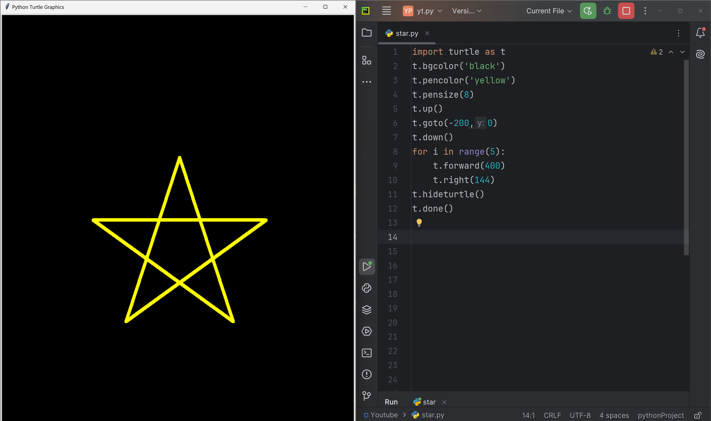

# Star pattern

A mesmerizing Python script that generates a stunning, colorful star pattern using the Turtle graphics library. 

# Tutorial is available on youtube channel 
click on the link to see :- ([Open in Youtube](https://youtu.be/d_-aNC68qy0))

# Screenshot

Star Pattern

ion
Perfect for art, design, and coding enthusiasts alike

# Run
To run this code, save it to a file with a .py extension (e.g., stellar_whirlwind.py) and execute it using Python (e.g., stellar_whirlwind.py). This will launch a window displaying the Rainbow Vortex pattern.

# License
This code is licensed under the MIT License. Feel free to modify, distribute, and use it for any purpose.

# snake.coding
We create a project each 4 days with voting on our <a href="https://youtube.com/@snakecoding_12" target="_blank">Youtube</a> channel.
You can vote for upcoming projects on our channel **community** page :wink:

